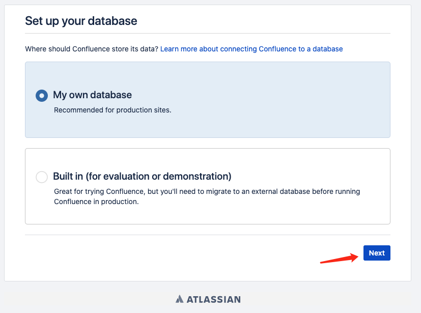

# docker部署confluence
注意：本次部署文件是已经破解的，破解过程可以跳过,直接部署。
## 破解过程
### 下载jar包
```
atlassian-extras-decoder-v2-3.2.jar  
下载地址：https://pan.baidu.com/s/1eRKDDOA    
获取密码：mbjp

atlassian-universal-plugin-manager-plugin-2.22.jar
下载地址：https://pan.baidu.com/s/1o7Lfv6M    
提取密码：1i3y
```
### 替换容器中的jar

注意：本次部署文件使用的是挂载的形式去替换。
```
用atlassian-extras-decoder-v2-3.2.jar 
替换 atlassian/confluence-server容器中
/opt/atlassian/confluence/confluence/WEB-INF/lib路径下atlassian-extras-decoder-v2-*.jar 

用atlassian-universal-plugin-manager-plugin-2.22.jar
替换atlassian/confluence-server容器中
/opt/atlassian/confluence/confluence/WEB-INF/atlassian-bundled-plugins路径下atlassian-universal-plugin-manager-plugin-*.jar
```
### 数据库设置
```
数据库设置已经在./data/mysql/conf/mysqld.cnf中，无需改动
```
## 部署
### 启动
```
docker-compose up -d
```
查看容器启动情况
```
docker ps 
```
结果

### 初始化数据库

进入mysql容器
```
docker exec -it <mysql_CONTAINER_ID> bash
```


连接mysql
```
mysql -uroot -proot
```


新建confluence数据库
```
create database `confluence` default character set utf8mb4 collate utf8mb4_bin;
```


### 配置confluence

浏览器访问http://localhost:8090




数据库
```
Database URL：jdbc:mysql://mysql:3306/confluence?characterEncoding=utf-8&useSSL=false
Username：root
Password：root
```


等待执行完毕


